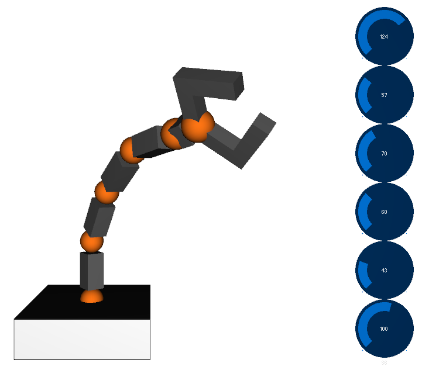

# Robotics Arm Control with Processing and Arduino
## Introduction:
<div style="display: flex;">

  <div style="flex: 1;">
    This repository aims to help you program a sketch that offers a 3D simulation of a robotic arm with a graphical user interface (GUI) for controlling its movements. Designed to communicate with an Arduino board using the serial communication protocol, the program will allow users to interactively manipulate the arm's servo motors through a visual interface. The GUI incorporates six sliders, each corresponding to a specific servo motor, enabling users to intuitively adjust angles and observe real-time changes in the 3D arm representation.
  </div>

  <div style="flex: 1; margin-left: 20px;">
    
  </div>

</div>
 This repository aims to help you program a sketch that offers a 3D simulation of a robotic arm with a graphical user interface (GUI) for controlling its movements. Designed to communicate with an Arduino board using the serial communication protocol, the program will allow users to interactively manipulate the arm's servo motors through a visual interface. The GUI incorporates six sliders, each corresponding to a specific servo motor, enabling users to intuitively adjust angles and observe real-time changes in the 3D arm representation.

## Structure
This repository provides all the necessary resources for creating programs using Processing and Arduino to control a robotic arm. The repository includes the following folders:
1. **Arduino**: Contains the Arduino program that is compatible with all the Processing programs in this repository.
2. **Processing Mouse**: This folder contains a simple Processing program enabling an initial interaction with the connection between Processing, Arduino, and the robotic arm. The program allows you to control the arm's servos using the mouse wheel, employing relative angles.
3. **Processing Slider**: Running the program in this folder displays an image of the 6-degree robotic arm with implemented knobs for each servo. This program aids in gaining familiarity with the knobs, facilitating control of the robotic arm using absolute angles.
4. **Processing 3D**: This folder houses a more complex version of the program. It creates a 3D representation of the robotic arm in Processing, replicating the same movements as the physical robot connected to your Arduino Board.

The following sections provide detailed information about each program.
## General prerequisites
- [Arduino IDE](https://www.arduino.cc/en/software) installed on your computer.
- [Processing IDE](https://processing.org/download/) installed on your computer.
- 6DoF Robotics arm: I have used this [one](https://www.amazon.it/Taidda-Manipolatore-Industriale-insegnamento-Universitario/dp/B084FSVQYC/ref=asc_df_B084FSVQYC/?tag=googshopit-21&linkCode=df0&hvadid=459268327566&hvpos=&hvnetw=g&hvrand=11317279051347235925&hvpone=&hvptwo=&hvqmt=&hvdev=c&hvdvcmdl=&hvlocint=&hvlocphy=20569&hvtargid=pla-1001227747582&psc=1&mcid=f9a52a06b82c34429ae7a00b076da8ab) but I have to say that I have found a lot of problem with the servos. I suggest you to by a more expensive one that will last longer and will have a better construction quality.

# 1. Arduino ServoEasing Control

This Arduino sketch allows you to control up to 6 servo motors with easing functions using the ServoEasing library. The code is designed to receive commands through the serial monitor to switch between servos, set absolute angles, and move servos in relative angles.

## Prerequisites

- Arduino IDE installed on your computer.
- ServoEasing library installed. You can find it [here](https://www.arduino.cc/reference/en/libraries/servoeasing/).

## Configuration

1. **Servo Configuration**: Modify the servo attachment settings in the `setup` function to match your servo connections.

    ```cpp
    Servo0.attach(11, 90, 600, 2400, 0, 180);
    Servo1.attach( /* your_pin */ , 90, 600, 2400, 0, 180);
    Servo2.attach(9, 90, 600, 2400, 0, 180);
    // ... (repeat for Servo3 to Servo5)
    ```

    Ensure that you replace `/* your_pin */` with the actual pin number for `Servo1`.

2. **Easing Configuration**: Choose the easing functions you want to enable by uncommenting the corresponding `#define` statements in the beginning of the code.

    ```cpp
    #define ENABLE_EASE_QUADRATIC
    // Uncomment others as needed
    ```

3. **Initial Setup**: Set the maximum number of servo objects and other parameters.

    ```cpp
    #define MAX_EASING_SERVOS 6
    short unsigned int vel = 50;
    ```

    Adjust `MAX_EASING_SERVOS` based on the number of servo motors you are using.

## Usage

1. Upload the code to your Arduino board.

2. Open the serial monitor in the Arduino IDE.

3. Send commands to control the servos:
   - `k` followed by a number (1 to 6): Switch to the specified servo.
   - `a` followed by a number: Move the selected servo to the requested absolute angle.
   - `r` followed by a number: Move the selected servo in a relative angle.

## Serial Commands

- `k`: Switch servo.
- `a`: Set absolute angle for the selected servo.
- `r`: Move the selected servo in a relative angle.

## Example

1. To switch to Servo 3: Send `k3`.
2. To set Servo 1 to angle 45 degrees: Send `a45`.
3. To move Servo 2 by +10 degrees: Send `r10`.

Feel free to modify the code to suit your specific requirements.

# 2. Processing Mouse

This Processing sketch allows you to control a robotic arm using the mouse and keyboard. It communicates with an Arduino board using the serial communication protocol.

## Setup

### Prerequisites

- Arduino board connected to your computer.
- [Processing Serial Library](https://processing.org/reference/libraries/serial/index.html)

### Instructions

1. Install the Processing IDE if not already installed.

2. Connect your Arduino board to your computer.

3. Open the Processing sketch.

4. Run the sketch.

## Code Overview
### Setup Function
The setup function initializes the sketch, creates a new window, sets its size, and establishes communication with the Arduino.

### Mouse Wheel Interaction
The mouseWheel function is called when the mouse wheel is scrolled. It sends the scroll direction to the Arduino.

### Keyboard Interaction
The keyPressed function is called when a key is pressed. It sends the key value to the Arduino if it is a valid input.

# 3. Processing Mouse

This Processing sketch enables graphical control of a robotic arm using sliders. The program communicates with an Arduino board via the serial communication protocol.

## Setup

### Prerequisites

- Arduino board connected to your computer.
- [ControlP5 Processing Library](http://www.sojamo.de/libraries/controlP5/)

### Instructions

1. Install the Processing IDE if not already installed.

2. Connect your Arduino board to your computer.

3. Install the ControlP5 library. You can download it [here](http://www.sojamo.de/libraries/controlP5/). Follow the installation instructions on the website.

4. Open the Processing sketch.

5. Run the sketch.

## Code Overview

### GUI Setup
The setup function initializes the sketch, creates a window with a fixed size, and loads a background image. It also initializes the ControlP5 GUI object and creates six round sliders for each servo.

### Draw Function
The draw function is executed in an infinite loop and sets the background color to white while displaying the background image.

### ControlEvent Function
The controlEvent function is triggered every time a slider is moved. It sends the servo number and angle to the Arduino board via serial communication.

# 4. Processing 3D 
I suggest you, to use the knowledge developed in previous programs to try to create a 3D representation of the robotic arm and set up all. you can later look at this solution to understand all the tricks I used. Make attention on
### Prerequisites

- Arduino board connected to your computer.
- [ControlP5 Processing Library](http://www.sojamo.de/libraries/controlP5/)

### Instructions

1. Install the Processing IDE if not already installed.

2. Connect your Arduino board to your computer.

3. Install the ControlP5 library. You can download it [here](http://www.sojamo.de/libraries/controlP5/). Follow the installation instructions on the website.

4. Open the Processing sketch.

5. Run the sketch.

## Code Overview

### GUI Setup
The setup function colouralizes the sketch, loads a logo image, sets up a 3D screen, and initializes the ControlP5 GUI object. It also creates six round sliders for each servo.

### Draw Function
The draw function is executed in an infinite loop and sets up the 3D environment. It creates the various parts of the robotic arm and updates their positions based on the slider values.

### ControlEvent Function
The controlEvent function is triggered every time a slider is moved. It sends the servo number and angle to the Arduino board via serial communication.

Feel free to modify the code and customize it according to your robotic arm setup.
